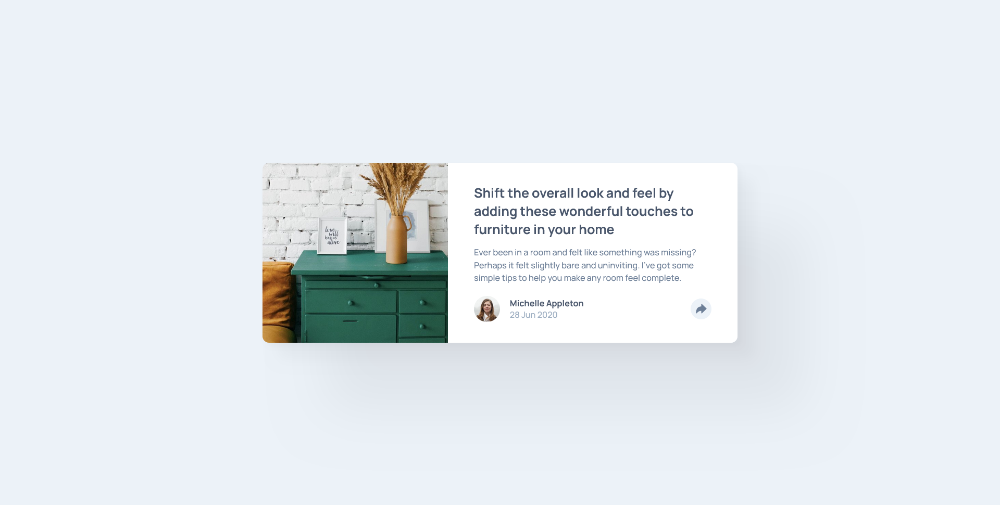
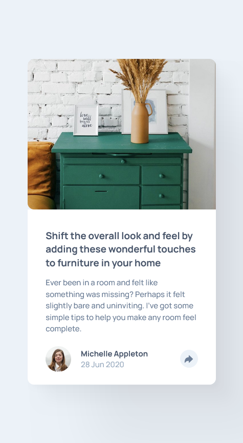
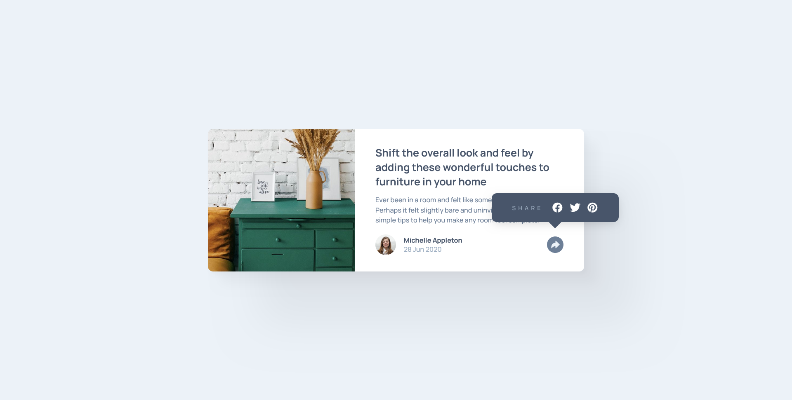

# Frontend Mentor - Article preview component solution

This is a solution to the [Article preview component challenge on Frontend Mentor](https://www.frontendmentor.io/challenges/article-preview-component-dYBN_pYFT). Frontend Mentor challenges help you improve your coding skills by building realistic projects.

## Table of contents

- [Overview](#overview)

  - [The challenge](#the-challenge)
  - [Screenshot](#screenshot)
  - [Links](#links)

- [My process](#my-process)

  - [Built with](#built-with)
  - [What I learned](#what-i-learned)
  - [Useful resources](#useful-resources)

- [Author](#author)

## Overview

### The challenge

Users should be able to:

- View the optimal layout for the component depending on their device's screen size
- See the social media share links when they click the share icon

### Screenshot

#### Desktop

#### Mobile

#### Active

### Links

- Solution URL: [GitHub](https://github.com/Ibtehaj-Ali-1/Article-Preview-Component)
- Live Site URL: [Article Preview Component](https://article-preview-component-two-gold.vercel.app/)

## My process

### Built with

- Semantic HTML5 markup
- CSS custom properties
- Flexbox
- CSS Grid

### What I learned

- How to use CSS Grid to create a responsive layout
- How to use Flexbox to create a responsive layout
- How to use CSS custom properties to create a responsive layout
- How to use CSS Grid and Flexbox together to create a responsive layout
- How to use CSS Grid and Flexbox to create a responsive layout that adapts to different screen
- Learned Basics of _JS_

### Useful resources

- [Ionic.io](https://ionic.io/) - This helped me for using icons in my project by including script links in my `index.html` file. I really liked this library and will use it going forward.

## Author

- Website - [Ibtehaj Ali](https://github.com/Ibtehaj-Ali-1)
- Frontend Mentor - [@Ibtehaj-Ali-1](https://www.frontendmentor.io/profile/Ibtehaj-Ali-1)
